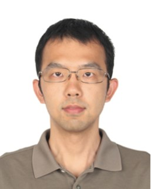
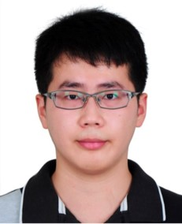
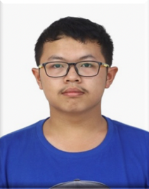
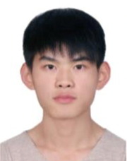
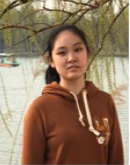
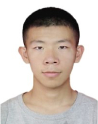
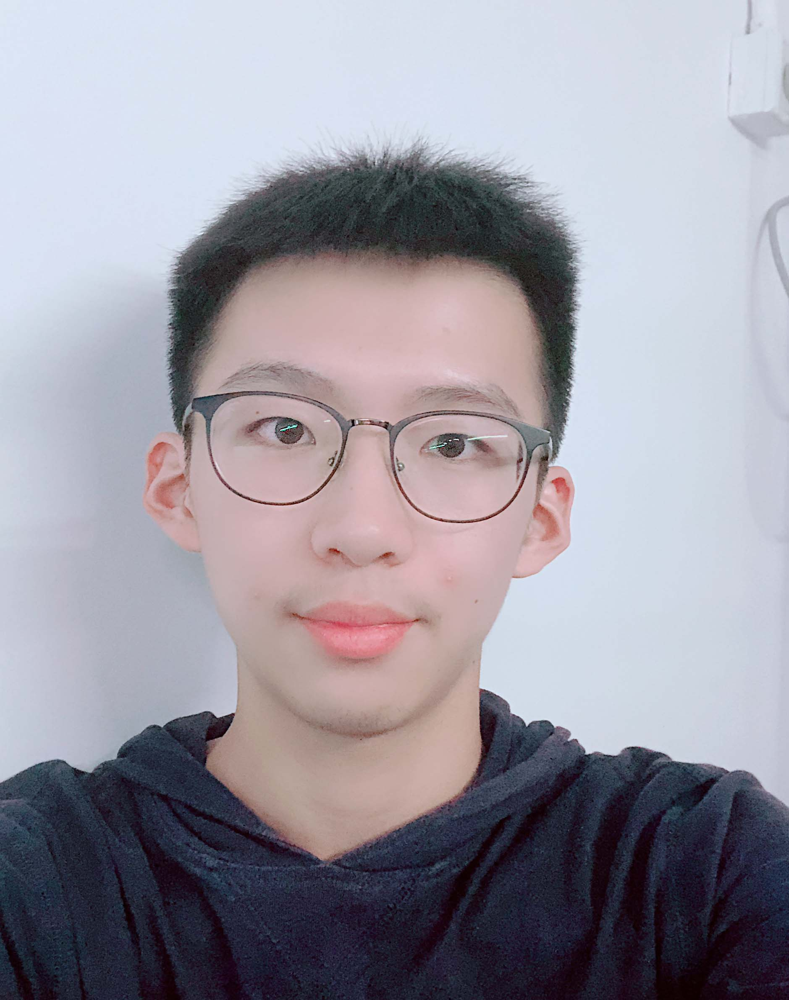
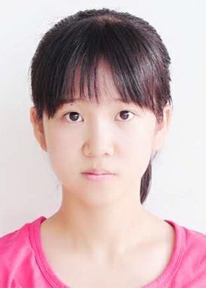
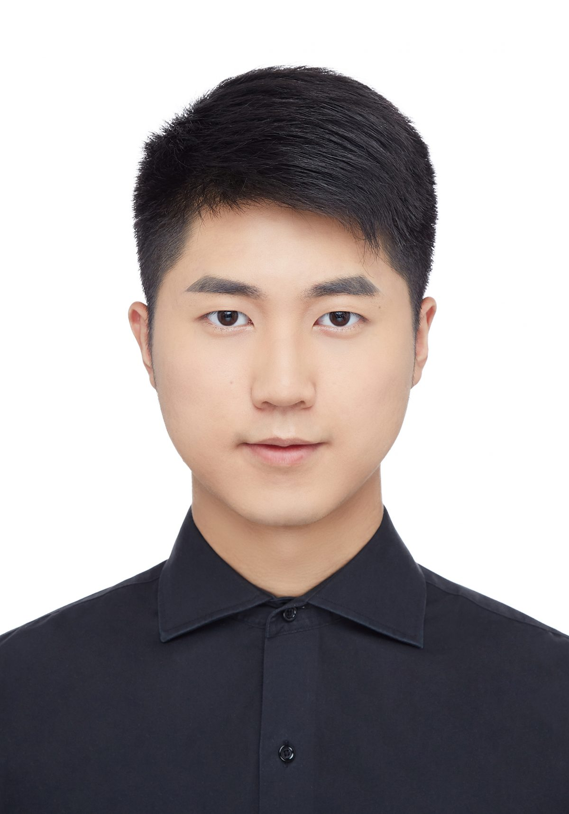

+ 	[Dr.Feng Zhang](https://fengzhangcs.github.io/)
+ 	[Lin Yang (Stream processing systems)](http://iir.ruc.edu.cn/~yangl/) 
+ 	[Ningxuan Feng (HPC and graph computing)](http://parasys.cn/?page_id=175)
+ 	Zheng Chen (Heterogeneous computing)
+ 	Jiya Su (Machine learning)
+ 	Dalin Wang (Intelligent database systems)
+ 	[Weitao Wan](http://parasys.cn/?page_id=61)
+ 	Yani Liu
+ 	[Tenggan Zhang](http://parasys.cn/?page_id=198)
+ 	Ruofan Wu
+ 	Zhengjie Fang

